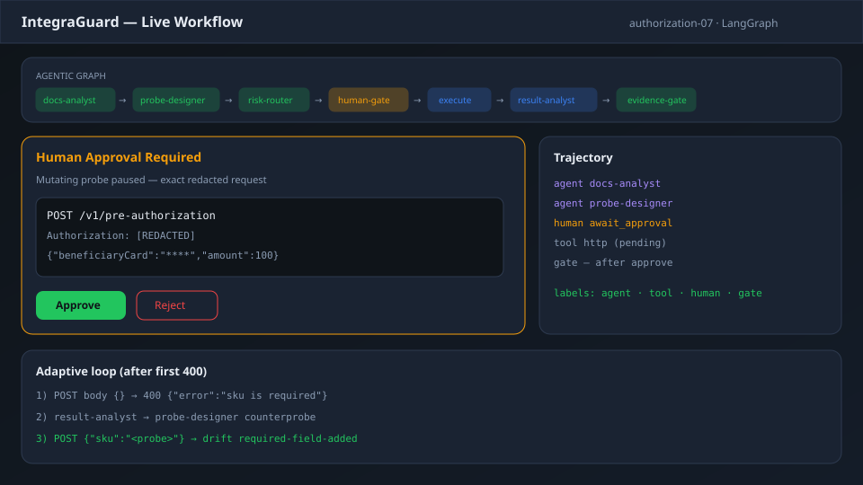
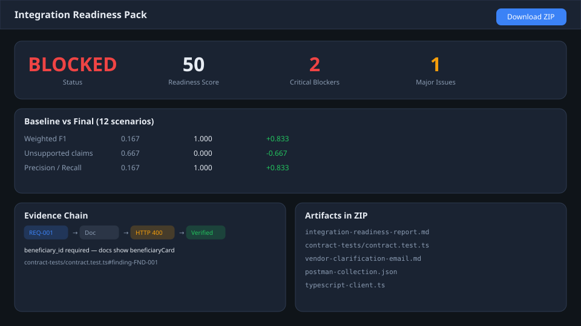
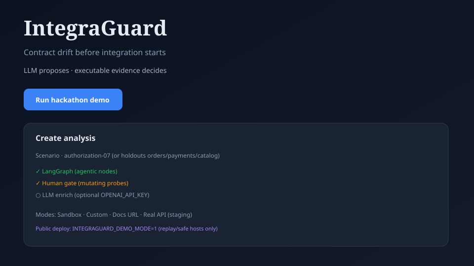

# IntegraGuard


> Transform incomplete API documentation into a verified integration readiness pack — with executable tests, proven blockers, and vendor-ready questions.


Agentic API integration preflight for hackathon delivery. **LLM proposes hypotheses; executable evidence decides.**


## Screenshots


| Live Workflow (Human gate) | Readiness Pack + Evidence Chain |

|---|---|

|  |  |


| Create Analysis — Real API mode |

|---|

|  |


## Quick Start


```bash

pnpm install

cp .env.example .env.local   # optional: OPENAI_API_KEY for LLM mode

docker compose up -d          # sandbox on :4000

pnpm build                    # compile workspace packages (required once)

pnpm dev                      # web UI on :3000

pnpm eval:baseline            # V0 baseline metrics

pnpm eval:final               # V4 evidence-gate metrics

pnpm eval:compare v0-baseline v4-evidence-gate

```


## Demo Scenario


Use **authorization-07** — multi-blocker pre-authorization case:

- Undocumented `beneficiary_id` (docs show `beneficiaryCard`)

- HTTP 200 with `businessStatus: error`

- False idempotency claims


Enable **Human gate** in the UI for the best live demo.


Or use **Docs URL** mode: paste any API reference URL (Stripe-like docs, Mintlify, Readme, Redoc…). IntegraGuard crawls same-origin pages, discovers OpenAPI when present, extracts endpoints (LLM + heuristics), then runs evidence-gated probes against your staging base URL.


## Results (12 scenarios)


| Metric | V0 Baseline | V4 Final | Δ |

|--------|-------------|----------|---|

| Weighted F1 | 0.167 | **1.000** | +0.833 |

| Unsupported claim rate | 0.667 | **0.000** | −0.667 |


See [docs/submission-slide.md](docs/submission-slide.md) for a copy-paste hackathon slide.

## Hackathon submission

| Asset | Path |
|-------|------|
| Demo script (5 min video) | [docs/demo-script.md](docs/demo-script.md) |
| Judging checklist | [docs/hackathon-checklist.md](docs/hackathon-checklist.md) |
| Improvement changelog | [docs/improvement-changelog.md](docs/improvement-changelog.md) |
| CI eval pipeline | [.github/workflows/eval.yml](.github/workflows/eval.yml) |

Replace `YOUR_ORG` in the CI badge URL after pushing to GitHub.


## Modes


| Mode | Use case |

|------|----------|

| **Scenario template** | 12 synthetic sandbox cases for eval/demo |

| **Custom input** | Paste your own docs + payloads + sandbox URL |

| **Real API** | Point at staging API + fetch OpenAPI URL (Human gate recommended) |


## Architecture


```

Documentation + Goal → Requirements → Contract Mapper → Probe Planner

  → Sandbox HTTP → Adversarial Verifier → Evidence Gate → Readiness Pack

```


Optional: `OPENAI_API_KEY` enriches requirement extraction; **Evidence Gate always verifies**.


## Packages


| Package | Purpose |

|---------|---------|

| `packages/schemas` | Zod contracts (Evidence, Finding, ReadinessPack) |

| `packages/agents` | 4 specialized agents + optional LLM |

| `packages/tools` | HTTP probes, OpenAPI parser, schema validation |

| `packages/workflow` | Orchestration + Evidence Gate + LangGraph |

| `packages/evaluator` | Ground-truth F1 metrics + baseline V0 |

| `packages/artifact-builder` | Report, tests, Postman, TS client, email |

| `sandbox/` | Fastify synthetic APIs (12 scenarios) |

| `apps/web` | Next.js UI (3 screens) |


## Reproduction


See [docs/reproduction.md](docs/reproduction.md).


## License


MIT

