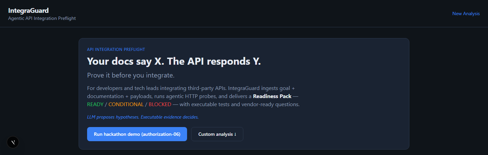
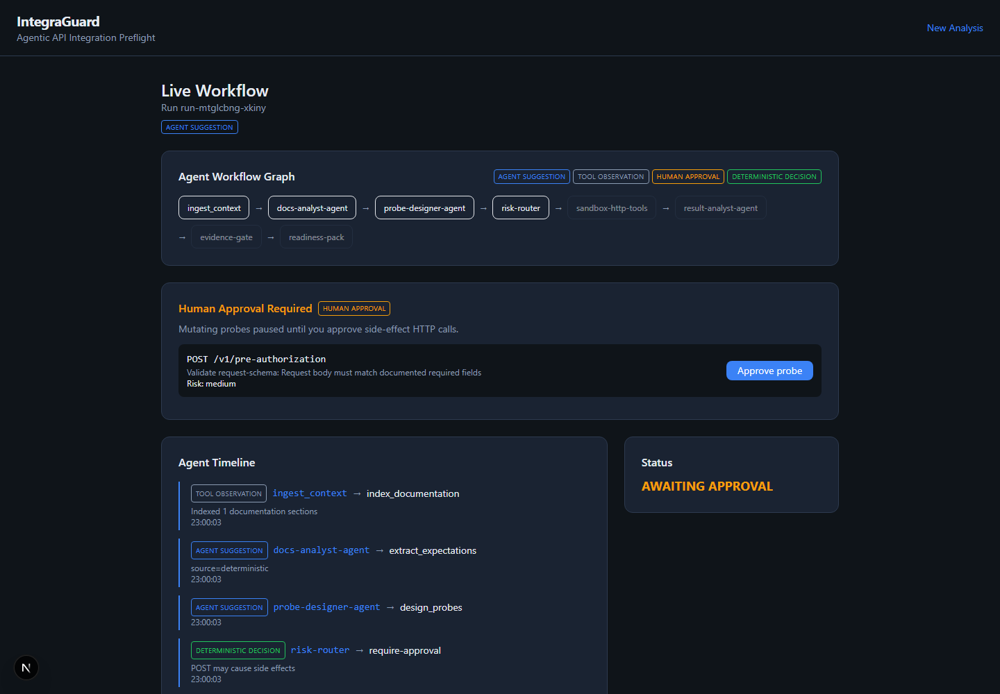
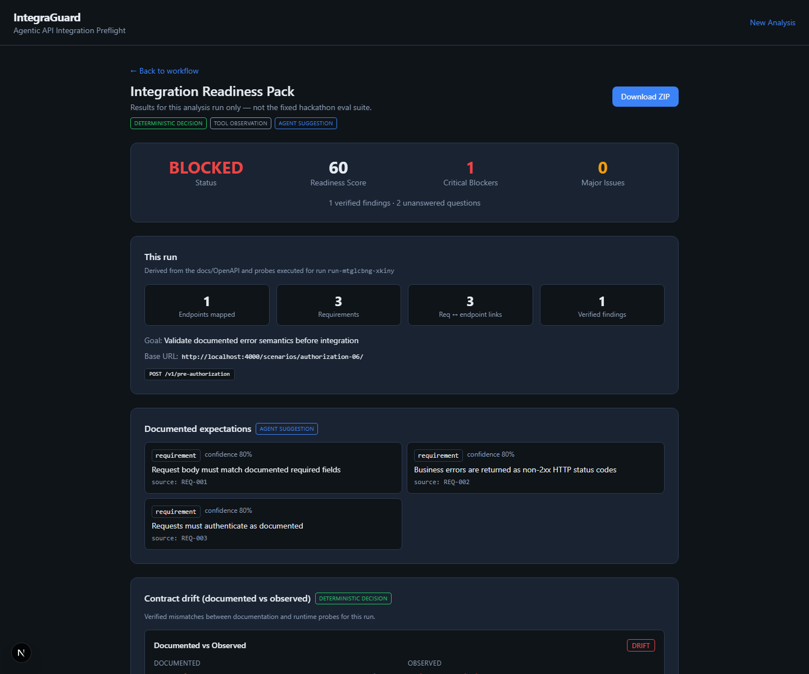

# IntegraGuard

> IntegraGuard compares what an API documents with what it actually does, detects **contract drift** before integration work starts, and turns every verified mismatch into reproducible evidence and contract tests.

Agentic API integration preflight. **LLM proposes hypotheses; executable evidence decides.** Agents interpret docs and plan probes — OpenAPI parsing, HTTP execution, risk policy, redaction, and the Evidence Gate stay deterministic.


## Screenshots

### Contract-drift preflight



### Agentic workflow with Human Gate



### Integration Readiness Pack




## Quick Start

```bash
pnpm install --frozen-lockfile
cp .env.example .env.local   # optional: OPENAI_API_KEY for LLM mode
docker compose up -d          # sandbox on :4000
pnpm build                    # compile workspace packages (required once)
pnpm test
pnpm integraguard check --config integraguard.config.example.yaml --safe
pnpm dev                      # web UI on :3000
```

### CLI (local / CI)

```bash
pnpm integraguard check --config integraguard.config.yaml
pnpm integraguard check --config integraguard.config.yaml --agentic --llm
pnpm integraguard snapshot --config integraguard.config.yaml --out .integraguard/baseline.json
pnpm integraguard check --config integraguard.config.yaml --baseline .integraguard/baseline.json
pnpm integraguard replay runs/<id>.json
```

Exit codes: `0` ready · `1` verified drift · `2` config/error · `3` inconclusive.

Copy `integraguard.config.example.yaml` → `integraguard.config.yaml`. Secrets stay in env vars (`credentials.apiKeyEnv`), never in YAML.

### Eval

```bash
pnpm eval:baseline          # deterministic V0 baseline
pnpm eval:final             # deterministic Evidence Gate runner
pnpm eval:agentic           # agentic (fallback) → runs/agentic-fallback/
pnpm eval:compare v0-baseline v4-evidence-gate
```

**Deterministic metrics ≠ agentic metrics.** `eval:baseline` / `eval:final` measure the fixed Evidence Gate path; `eval:agentic` stamps mode + instructionVersion + timestamp under `runs/agentic-fallback/` and must not be mixed into the same F1 table.


## Demo Scenario


Use **authorization-06** for the agentic demo:

- Documentation says business errors return HTTP 4xx
- Runtime returns HTTP 200 with `status: rejected` and `businessStatus: error`
- Human Gate pauses every POST before execution
- Final decision: **BLOCKED**, score 60, one critical verified drift


Enable **Human gate** in the UI for the best live demo.


Or use **Docs URL** mode: paste any API reference URL (Stripe-like docs, Mintlify, Readme, Redoc…). IntegraGuard crawls same-origin pages, discovers OpenAPI when present, extracts endpoints (LLM + heuristics), then runs evidence-gated probes against your staging base URL.


## Results (15 synthetic scenarios — deterministic benchmark)


| Metric | V0 Baseline | V4 Final | Δ |

|--------|-------------|----------|---|

| Macro severity-weighted F1 | 0.133 | **1.000** | +0.867 |

| Unsupported claim rate | 0.667 | **0.000** | −0.667 |


See [docs/submission-slide.md](docs/submission-slide.md) for a copy-paste hackathon slide.

## Hackathon submission

| Asset | Path |
|-------|------|
| Demo script (~3 min; 5 min maximum) | [docs/demo-script.md](docs/demo-script.md) |
| Improvement changelog | [docs/improvement-changelog.md](docs/improvement-changelog.md) |
| CI eval pipeline | [.github/workflows/eval.yml](.github/workflows/eval.yml) |


## Modes

| Mode | Use case |
|------|----------|
| **Scenario template** | Synthetic sandbox cases for eval/demo (auth + holdouts) |
| **Custom input** | Paste your own docs + payloads + sandbox URL |
| **Real API** | Staging API + docs/OpenAPI URL (Human gate recommended) |
| **Deterministic pipeline** | Default eval path — fixed agents/heuristics, no live LLM |
| **Agentic (LangGraph)** | UI LangGraph checkbox / CLI `--agentic` — real multi-node graph; set `INTEGRAGUARD_AGENTIC=0` for legacy wrapper |
| **LLM enrich** | Optional `--llm` / UI toggle when `OPENAI_API_KEY` is set; Evidence Gate still decides |

See [docs/product-workflow.md](docs/product-workflow.md), [docs/security-model.md](docs/security-model.md), [docs/llm-matrix.md](docs/llm-matrix.md), and [docs/holdout-results.md](docs/holdout-results.md).


## Architecture


```

Documentation + Goal → Docs Analyst → Probe Designer → Risk Router

  → Human Gate → HTTP Tools → Result Analyst ↺ optional follow-up

  → Deterministic Evidence Gate → Readiness Pack

```


Optional: `OPENAI_API_KEY` enriches requirement extraction; **Evidence Gate always verifies**.


## Packages


| Package | Purpose |

|---------|---------|

| `packages/schemas` | Zod contracts (Evidence, Finding, ReadinessPack) |

| `packages/agents` | 3 specialized agents (Docs Analyst, Probe Designer, Result Analyst) + optional LLM |

| `packages/tools` | HTTP probes, OpenAPI parser, schema validation |

| `packages/workflow` | Orchestration + Evidence Gate + LangGraph |

| `packages/evaluator` | Ground-truth F1 metrics + baseline V0 |

| `packages/artifact-builder` | Report, tests, Postman, vendor issue, CI reporters |

| `packages/cli` | `integraguard check|snapshot|replay` |

| `sandbox/` | Fastify synthetic APIs (12 authorization scenarios + 3 cross-domain holdouts) |

| `apps/web` | Next.js UI (create → run → pack) |


## Reproduction


See [docs/reproduction.md](docs/reproduction.md).


## License


MIT

